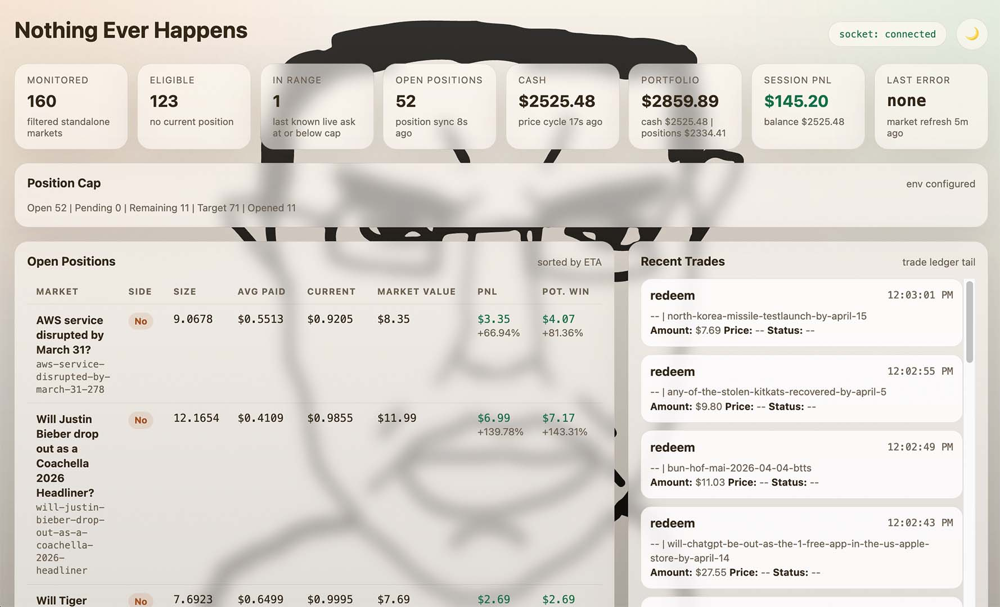

# Nothing Ever Happens Polymarket Bot

Focused async Python bot for Polymarket that buys No on standalone non-sports yes/no markets.

*FOR ENTERTAINMENT ONLY. PROVIDED AS IS, WITHOUT WARRANTY OF ANY KIND, EXPRESS OR IMPLIED. USE AT YOUR OWN RISK. THE AUTHORS ARE NOT LIABLE FOR ANY CLAIMS, LOSSES, OR DAMAGES.*



- `bot/`: runtime, exchange clients, dashboard, recovery, and the `nothing_happens` strategy
- `scripts/`: operational helpers for deployed instances and local inspection
- `tests/`: focused unit and regression coverage

## Runtime

The bot scans standalone markets, looks for NO entries below a configured price cap, tracks open positions, exposes a dashboard, and persists live recovery state when order transmission is enabled.

The runtime is `nothing_happens`.

## Features

- **GTC Limit Orders**: Places Good-Till-Cancelled limit orders on the bid side instead of using market orders, waiting for favorable fills while preserving capital.
- **Market Lifecycle Gates**: Configurable entry windows based on the market's total lifespan (e.g., only trading when a market is between 10% and 15% of its lifespan) or absolute seconds, avoiding highly volatile new markets or expiring markets.
- **Strict Rate Limiting**: Built-in synchronous token-bucket rate limiter (default: 5 RPS, burst 10) to respect Polymarket's CLOB API limits and avoid IP bans.
- **Secure Secret Handling**: Uses a custom `SecretStr` class and specialized JSON encoders to completely redact `PRIVATE_KEY` and other sensitive strings from all application logs and exception traces.
- **Dynamic Sizing**: Calculates trade sizes dynamically based on a percentage of available cash or a fixed USD amount, while ensuring exchange minimums are met.

## Safety Model

Real order transmission requires all three environment variables:

- `BOT_MODE=live`
- `LIVE_TRADING_ENABLED=true`
- `DRY_RUN=false`

If any of those are missing, the bot uses `PaperExchangeClient`.

Additional live-mode requirements:

- `PRIVATE_KEY`
- `FUNDER_ADDRESS` for signature types `1` and `2`
- `DATABASE_URL`
- `POLYGON_RPC_URL` for proxy-wallet approvals and redemption

## Setup

```bash
pip install -r requirements.txt
cp config.example.json config.json
cp .env.example .env
```

`config.json` is intentionally local and ignored by git.

## Configuration

The runtime reads:

- `config.json` for non-secret runtime settings
- `.env` for secrets and runtime flags

The runtime config lives under `strategies.nothing_happens`. See [config.example.json](config.example.json) and [.env.example](.env.example).

### Config Parameters

| Parameter | Description |
| --- | --- |
| `market_refresh_interval_sec` | How often to fetch the list of new standalone markets from the exchange API (in seconds). |
| `price_poll_interval_sec` | How often to check the order book for markets that meet your entry criteria (in seconds). |
| `position_sync_interval_sec` | How often to sync your current open positions and cash balance from the exchange (in seconds). |
| `order_dispatch_interval_sec` | The minimum delay between attempting to submit new limit orders to the exchange (in seconds). |
| `cash_pct_per_trade` | If `fixed_trade_amount` is 0, the bot will use this percentage of your available USDC balance for each trade (e.g., 0.01 = 1%). |
| `min_trade_amount` | The absolute minimum USD value to place on a single trade. Overrides `cash_pct_per_trade` if the calculated amount is too low. |
| `fixed_trade_amount` | A strict USD amount to use for every trade. If set > 0, this overrides `cash_pct_per_trade`. |
| `max_entry_price` | The maximum probability/price you are willing to pay for a "NO" share (e.g., 0.95 = 95%). |
| `allowed_slippage` | The maximum allowed price slippage when falling back to market orders (e.g., 0.3 = 30%). |
| `request_concurrency` | Maximum number of concurrent async requests made to the exchange when polling order books. |
| `buy_retry_count` | Number of times to retry a failed buy order before temporarily quarantining the market. |
| `buy_retry_base_delay_sec` | The base backoff delay between failed buy order attempts (in seconds). |
| `max_backoff_sec` | The absolute maximum time the bot will wait before re-checking a market that previously caused errors (in seconds). |
| `max_new_positions` | The maximum number of *new* positions the bot is allowed to open while running. Set to `-1` for unlimited. |
| `shutdown_on_max_new_positions` | If `true`, the bot will completely exit/stop running once `max_new_positions` is reached. |
| `redeemer_interval_sec` | How often the background redeemer task checks for winning positions to cash out (in seconds). |
| `clob_rate_limit_rps` | The maximum number of requests per second allowed to the CLOB exchange API. |
| `clob_rate_limit_burst` | The maximum burst of immediate requests allowed by the token-bucket rate limiter. |
| `min_market_age_sec` | A market must be at least this many seconds old before the bot will trade it. |
| `max_market_age_sec` | The bot will stop trading a market if its age exceeds this many seconds. Set to `0` or `"inf"` for no maximum. |
| `min_market_age_pct` | A market must have completed this percentage of its lifespan before trading (e.g., 0.1 = 10% elapsed). |
| `max_market_age_pct` | The bot will stop trading a market if its elapsed lifespan exceeds this percentage (e.g., 0.49 = 49% elapsed). |
| `min_time_remaining_sec` | A market must have at least this many seconds remaining until expiration to be traded. |
| `limit_order_max_age_sec` | How long an unfilled limit order is allowed to sit on the book before the bot cancels it to recalculate the price. Set to `0` or `"inf"` to never cancel. |
| `max_positions_per_category` | Maximum combined positions + pending orders in any single Polymarket category (e.g. "Politics", "Tech"). Prevents over-concentration in one theme. `-1` disables the limit (default). |

You can point the runtime at a different config file with `CONFIG_PATH=/path/to/config.json`.

## Running Locally

```bash
python -m bot.main
```

The dashboard binds `$PORT` or `DASHBOARD_PORT` when one is set.

## Heroku Workflow

The shell helpers use either an explicit app name argument or `HEROKU_APP_NAME`.

```bash
export HEROKU_APP_NAME=<your-app>
./alive.sh
./logs.sh
./live_enabled.sh
./live_disabled.sh
./kill.sh
```

Generic deployment flow:

```bash
heroku config:set BOT_MODE=live DRY_RUN=false LIVE_TRADING_ENABLED=true -a "$HEROKU_APP_NAME"
heroku config:set PRIVATE_KEY=<key> FUNDER_ADDRESS=<addr> POLYGON_RPC_URL=<url> DATABASE_URL=<url> -a "$HEROKU_APP_NAME"
git push heroku <branch>:main
heroku ps:scale web=1 worker=0 -a "$HEROKU_APP_NAME"
```

Only run the `web` dyno. The `worker` entry exists only to fail fast if it is started accidentally.

## Tests

```bash
python -m pytest -q
```

## Included Scripts

| Script | Purpose |
| --- | --- |
| `scripts/db_stats.py` | Inspect live database table counts and recent activity |
| `scripts/export_db.py` | Export live tables from `DATABASE_URL` or a Heroku app |
| `scripts/wallet_history.py` | Pull positions, trades, and balances for the configured wallet |
| `scripts/parse_logs.py` | Convert Heroku JSON logs into readable terminal or HTML output |

## Repository Hygiene

Local config, ledgers, exports, reports, and deployment artifacts are ignored by default.
